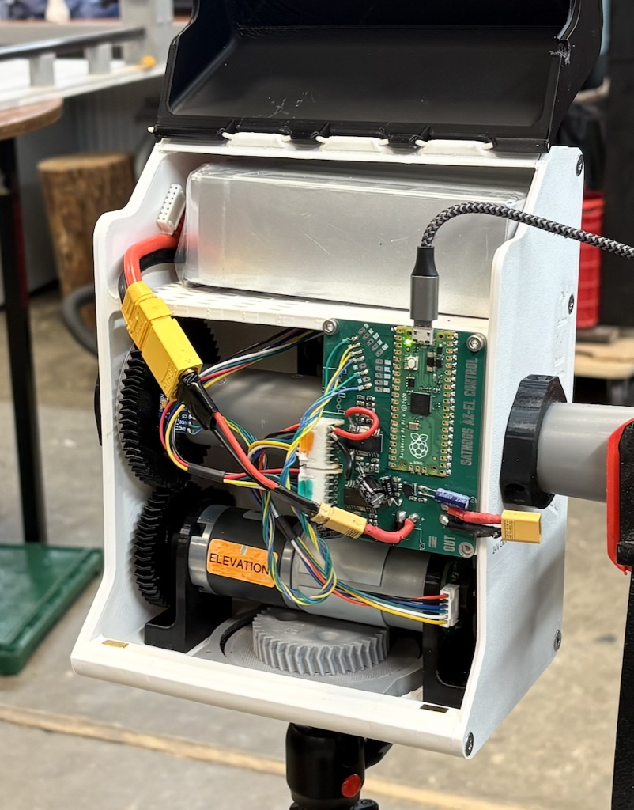
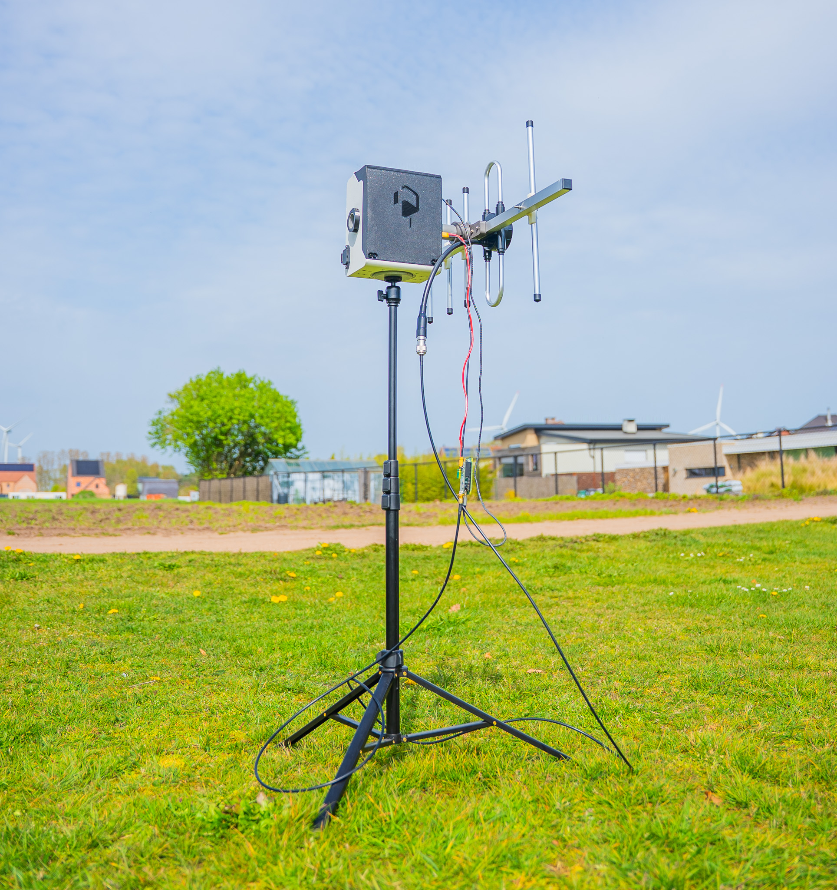

# SatNOGS Basestation

Portable, SatNOGS-compatible ground station for the **AetherSpace CubeSat** at 433 MHz.
Built as a joint Master's thesis at KU Leuven (Campus Geel), 2025–2026.

<p align="center">
  
  
</p>

<p align="center">
  <b>3D-printable rotator</b> · <b>1/4"-20 tripod mount</b> · <b>EasyComm / hamlib compatible</b>
</p>

---

## What this is (and what it isn't)

This project is a **deliberate alternative** to the canonical SatNOGS receive stack. A fully capable SatNOGS ground station can be built with a Raspberry Pi 3, the official `satnogs-client`, an RTL-SDR dongle, and any hamlib-compatible rotator — and for receiving arbitrary amateur satellites that is the right choice. We built this station instead because:

1. **AetherSpace-specific.** The AetherSpace CubeSat carries a TI CC1200 transceiver. Using the same CC1200 on the ground guarantees modulation-format compatibility and avoids the software-demodulator complexity of matching a CubeSat's exact FSK parameters in GNU Radio.
2. **Educationally interesting.** The build spans mechanical design (3D-printed rotator, printed ball bearings, herringbone gears), PCB design (dual-RP2040 + CC1200 HAT), embedded firmware (EasyComm III, PID, encoder ISRs, COBS protocol, PIO-based AX.25 G3RUH decoder), Pi-side software (pass prediction, Doppler, phone-first HTTPS dashboard), and protocol integration (SiDS to the SatNOGS DB). An SDR-based station would skip most of that.
3. **Portable and self-contained.** Deploys in minutes on a tripod, configured from a phone — no laptop, no SSH. This is harder with the GNU Radio-based `satnogs-client` which expects a persistent host.

If you want a general-purpose SatNOGS station today, run **`satnogs-client` + RTL-SDR on a Pi 3B+** with any EasyComm-speaking rotator (including this one). If you want to track AetherSpace or learn how a ground station is built end-to-end, use this.

---

## System overview

```
                    ┌──────────────────────────────────┐
                    │       Raspberry Pi 3A+           │
                    │  rotctld + station.py + HTTPS UI │
                    │  (SiDS telemetry; no satnogs-    │
                    │   client — SDR-centric)          │
                    │  USB serial ──────── UART ────── │
                    └──────┬───────────────────┬───────┘
                           │                   │
                    ┌──────┴──────┐     ┌──────┴──────┐
                    │  MotorPCB   │     │   RF HAT    │
                    │   RP2040    │     │  Pico + 2×  │
                    │  TB6642FG   │     │   CC1200    │
                    │  encoders   │     │  UHF (432)  │
                    │  ADXL345    │     │  VHF routed │
                    └──────┬──────┘     └──────┬──────┘
                           │                   │
                    ┌──────┴──────┐     ┌──────┴──────┐
                    │ AZ/EL motors│     │  SMA → Yagi │
                    │ + gearboxes │     │   antenna   │
                    └─────────────┘     └─────────────┘
```

> **v1** (above) is the field-validated configuration — two separate boards, USB for the rotator, UART for the RF HAT.
> **v2** (`MOTOR_RF_HAT/`) is the design-complete successor — one Pi HAT, A4950 motor drivers, 100 Ω GPIO series resistors on the driver lines. Routed and BOM-finalised; not yet fabricated.

---

## Repository structure

| Path | Contents |
|------|----------|
| [`Firmware/rp2040-satnogs-rotator/`](Firmware/rp2040-satnogs-rotator/) | Rotator Pico firmware — EasyComm III, 100 Hz PID, IMU-based EL homing, runaway detection, watchdog |
| [`Firmware/rp2040-rf-hat/`](Firmware/rp2040-rf-hat/) | RF HAT Pico firmware — COBS/CRC-16 protocol, dual CC1200 SPI driver, PIO serial-mode RX + AX.25 G3RUH decoder |
| [`MotorPCB/`](MotorPCB/) | v1 KiCad 9 rotator controller PCB (13 hierarchical sub-sheets). Field-deployed. |
| [`RF_HAT/`](RF_HAT/) | v1 dual-CC1200 Pi HAT (source: `rf_hat_circuit.py` → generates `RF_HAT_out/`). Field-deployed. |
| [`MOTOR_RF_HAT/`](MOTOR_RF_HAT/) | v2 combined motor-control + RF HAT (design-complete, routed, ready to order). Thesis-final hardware. |
| [`Pi/`](Pi/) | Python station stack: `station.py`, `dashboard.py`, `rf_hat.py`, `sat_library.py`, decoders, systemd services, SmartRF configs |
| [`Hardware/`](Hardware/) | Motor + driver datasheets (FAPG36-555-EN, TB6642FG) |
| [`ThesisPaper/images/`](ThesisPaper/images/) | All thesis visuals: `figures/` (plots), `figures/evidence/` (reception evidence plots), `photos/` (hardware + CAD) — consumed by LaTeX `\graphicspath{./images/}` |
| [`ThesisPaper/`](ThesisPaper/) | LaTeX thesis (KU Leuven FIIW template) + rendered figures |
| [`tools/`](tools/) | Analysis utilities (`analyze_passes.py` — generates the reception-evidence report) |
| [`RF_Devboard/`](RF_Devboard/) | CC1200 RF dev board (predecessor to the HAT): Altium PCB, Pico SDK driver, PC test GUI |
| [`docs/`](docs/) | System architecture diagram (`.drawio` + HTML render) |
| `captures/` | Raw RF captures per pass (gitignored — kept on disk only) |
| `Papers/` | Reference material including Hanssens (2023) baseline thesis (gitignored) |

| Firmware artifact (at repo root) | Built by |
|----------------------------------|----------|
| `firmware.uf2` | `Firmware/rp2040-satnogs-rotator/` (v1 rotator) |
| `rf_hat_firmware.uf2` | `Firmware/rp2040-rf-hat/` (v1 RF HAT) |
| `motor_rf_hat_firmware.uf2` | `Firmware/rp2040-motor-rf-hat/` (v2 combined) |

---

## Hardware

| Component | Details |
|-----------|---------|
| **MCU** | RP2040 (Raspberry Pi Pico), one per board (v1); single RP2040 on v2 |
| **Motor driver (v1)** | 2× TB6642FG full-bridge (24 V, 20 kHz PWM) |
| **Motor driver (v2)** | 2× A4950 (standard, in-stock; replaces scarce TB6642FG) |
| **Motors** | FAPG36-555-EN, 24 V, 16 RPM, 516:1 internal planetary gearbox |
| **Encoders** | 2-channel Hall (64 edges/rev, 4× quadrature) |
| **IMU** | ADXL345 3-axis accelerometer (EL auto-homing at boot) |
| **RF** | 2× TI CC1200 on 6-layer Pi HAT — UHF (432 MHz) populated, VHF (144 MHz) routed only |
| **Antenna** | Siretta Oscar 44 Yagi, 434 MHz, ~9 dBi (used in field testing) over 3 m RG-58 |
| **Station computer** | Raspberry Pi 3 Model A+, Debian 13 (Trixie), armhf 32-bit |

### Axis gearing

| Axis | External ratio | Total ratio | Ticks/degree | Travel |
|------|----------------|-------------|--------------|--------|
| Azimuth | 15:40 (2.667:1) | 1376:1 | 244.6 | ±360° |
| Elevation | 40:55 (1.375:1) | 709.5:1 | 126.1 | 0–180° |

No slip ring — AZ rewinds between passes via `PARK`. Shortest-path wrapping handles north crossings automatically.

### Mechanical design

Fully 3D-printable in ASA (UV-resistant, Tg ≈ 100 °C). All structural parts fit a 220×220 mm build plate. Printed deep-groove ball bearings on both axes (3 mm steel balls, integrated races, press-in retainer). Double-helical (herringbone) gears, 15° helix, 1.333 mm normal module, 8 mm face width. Standard **1/4"-20 UNC tripod thread** on the base.

[View CAD on Onshape](https://cad.onshape.com/documents/a73149deb7dec0be4e4b4c14/w/e82e548d7d93085f89291bd5/e/c3e50364326e22d368cc64e2?renderMode=0&uiState=699de3ddf7c036f801c48281)

---

## LNA recommendation (RX sensitivity)

Field testing without an external LNA produced **no protocol-valid frame decodes** — the link budget (`ThesisPaper/draft_link_budget.md`) shows the measured system noise floor sits roughly 20 dB above thermal, and the AetherSpace 14 dBm / 2 dBi downlink has insufficient margin at ~600 km range in that configuration. Adding an LNA is the single highest-impact upgrade.

**Recommended path — mast-mounted LNA + bias-T:**

| Part | Role | Notes |
|------|------|-------|
| **Qorvo SPF5189Z** (or pre-built module, e.g. Nooelec SAWbird+ 433) | Primary LNA | NF 0.6 dB, ~20 dB gain at 433 MHz, SOT-89, +5 V, community standard for 433 MHz amateur RX |
| **Mini-Circuits PGA-103+** | Alternative | NF 0.5 dB, 21 dB gain, SMA module, more expensive |
| **EPCOS B39431B3710U410** (or equivalent) | 433.92 MHz SAW filter, pre-LNA | Rejects out-of-band interferers; improves linearity |
| Bias-T (on-PCB) | Feeds DC up the coax to power mast LNA | ~120 nH choke + DC-block capacitor + feedthrough |

**Why mast-mounted is preferred over PCB-integrated (Friis cascade):** the first stage's noise figure dominates the whole chain. Placing the LNA at the antenna bypasses ~0.6 dB of RG-58 loss *before* amplification, and avoids lifting board-level digital noise (RP2040, LMR51420 buck harmonics, Pi HDMI) into the RX path. A PCB-integrated LNA helps less for the same cost.

**TI CC1190 is not applicable here:** it is TI's companion range-extender for CCxxxx transceivers, but only covers 850–950 MHz. There is no TI-supplied LNA companion for CC1200 in the 410–475 MHz band, so an external discrete or module-based LNA is required.

The v2 MOTOR_RF_HAT should include a bias-T network on the UHF antenna port to make mast-LNA operation plug-and-play.

---

## Quick start

```sh
# Build rotator firmware
cd Firmware/rp2040-satnogs-rotator
pip install platformio
pio run
```

Flash: hold **BOOTSEL**, plug USB, copy `firmware.uf2` to the **RPI-RP2** drive.

Connect at 115200 baud (`pio device monitor` or any serial terminal):

```
AZ90.0 EL45.0    → move to position
AZ               → query current AZ/EL
STOP             → halt motors
PARK             → return to (0, 0)
VE               → firmware version
HELP             → list all commands
```

Full command reference and PID tuning: [`Firmware/rp2040-satnogs-rotator/README.md`](Firmware/rp2040-satnogs-rotator/README.md).

---

## SatNOGS integration

The rotator speaks **EasyComm III (hamlib model 204)** on the rotator path, so the Pi runs stock `rotctld` with no custom software. `rotctld.service` in [`Pi/services/`](Pi/services/) is the auto-start unit.

```sh
# rotctld exposes the rotator on TCP 4533
echo "p"             | nc <pi-ip> 4533   # query position
echo "P 90.0 30.0"   | nc <pi-ip> 4533   # command AZ 90, EL 30
```

### Satellite tracking

`Pi/station.py` predicts passes from CelesTrak TLEs via PyEphem, drives `rotctld` at 10 Hz, configures the CC1200 per satellite, applies Doppler correction at 2 Hz, and logs pass CSVs with 5 Hz telemetry.

```sh
cd ~/SatNOGS-Basestation/Pi
python3 station.py --list              # list upcoming passes
python3 station.py --sat "ISS"         # track a named satellite
python3 station.py --daemon            # auto-track all passes (no SSH)
```

See [`Pi/README.md`](Pi/README.md) for daemon mode, scan mode, and dashboard operation.

### SatNOGS DB (SiDS) vs `satnogs-client`

Decoded frames are submitted directly to `db.satnogs.org/api/telemetry/` via the SiDS (Simple Downlink Sharing) protocol. Station **4712 "Aether-Basestation"** is registered on the network; it will appear *offline* on the network map because we do not poll `/api/jobs/` — `satnogs-client`'s GNU Radio + SoapySDR pipeline is SDR-centric and incompatible with the CC1200 hardware packet modem.

**If you want the standard SatNOGS experience on top of this rotator:** install `satnogs-client` with any RTL-SDR dongle, set `SATNOGS_ROT_MODEL=ROT_MODEL_NETROTCTL` and `SATNOGS_ROT_PORT=localhost:4533`. The `RfBackend` abstraction in [`Pi/rf_backend.py`](Pi/rf_backend.py) also supports an RTL-SDR as a parallel path alongside the CC1200.

---

## Safety features

- **Runaway detection** — emergency stop if position exceeds soft limits by 50° (catches PID positive-feedback failures like the EL-inversion bug we hit in bring-up)
- **Soft limits** — AZ clamped to ±360°, EL clamped to 0–180°
- **Duty capping** — 95 % max PWM, avoids TB6642FG/A4950 over-current on motor stall
- **IMU-based EL homing** — drives EL to horizontal via ADXL345 gravity vector at boot
- **Shortest-path AZ wrapping** — 350°→10° takes the 20° path, not 340°; encoder re-centres after settling near ±360°
- **8 s hardware watchdog** — both Picos; includes homing loop
- **Driver fault lines** — TB6642FG ALERT pins wired to the RP2040 (currently bypassed in firmware; enable for v2)

---

## Design philosophy

- **Economical.** v2 rotator BOM (controller board + motors + mechanics) ≈ €75; ≈ €100 including the Pi.
- **Reproducible.** 3D-printable rotator on a consumer FDM printer, standard 1/4"-20 tripod, LCSC-basic components where possible.
- **Stock-protocol.** EasyComm + hamlib on the rotator; SiDS on the DB side. No proprietary glue.
- **Open source.** Hardware CERN-OHL-S, firmware and software MIT.

---

## Further reading

- [`ThesisPaper/`](ThesisPaper/) — full LaTeX thesis (KU Leuven FIIW template) and figures.
- [`ThesisPaper/draft_link_budget.md`](ThesisPaper/draft_link_budget.md) — link-budget analysis with LNA impact.
- [`docs/system_architecture.drawio`](docs/system_architecture.drawio) — editable system diagram (`docs/system_diagram.html` renders it).
- Per-board READMEs under [`Firmware/`](Firmware/), [`Pi/`](Pi/), [`MotorPCB/`](MotorPCB/), [`RF_HAT/`](RF_HAT/), and [`MOTOR_RF_HAT/`](MOTOR_RF_HAT/).
