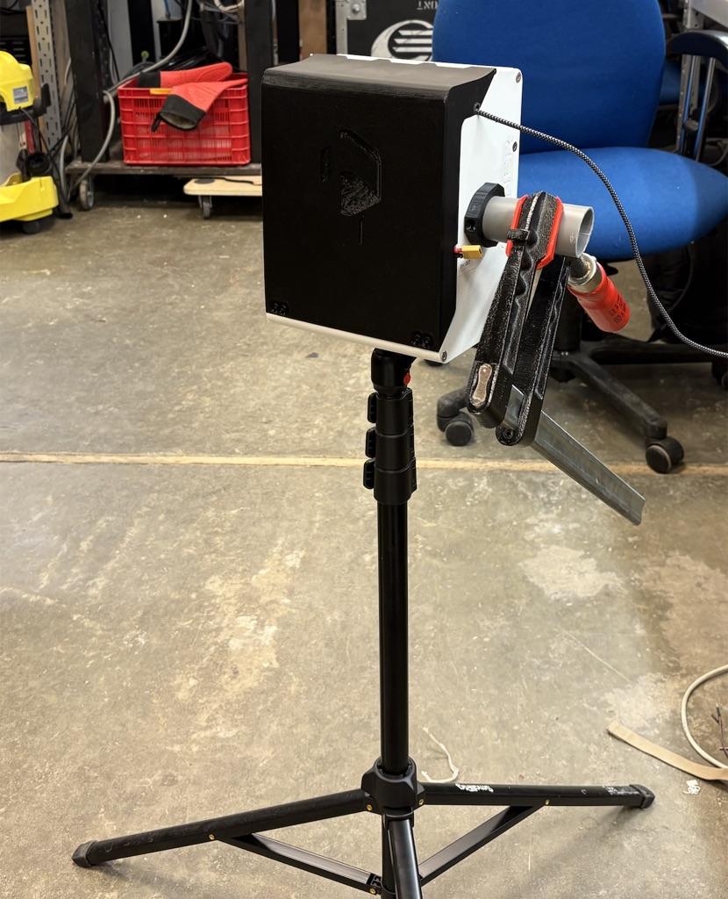

# SatNOGS Basestation

SatNOGS-compatible ground station for tracking the **AetherSpace CubeSat** at 433 MHz. Built as a Master's thesis project at KU Leuven (Campus Geel).

<p align="center">
  
  
</p>

<p align="center">
  <b>3D-printable rotator</b> · <b>1/4"-20 tripod mount</b> · <b>SatNOGS compatible</b>
</p>

---

## System overview

```
                    ┌──────────────────────────────────┐
                    │       Raspberry Pi 3A+           │
                    │  satnogs-client + rotctld        │
                    │                                  │
                    │  USB serial ──────── UART ────── │
                    └──────┬───────────────────┬───────┘
                           │                   │
                    ┌──────┴──────┐     ┌──────┴──────┐
                    │  Motor PCB  │     │   RF HAT    │
                    │   RP2040    │     │  Pico + 2x  │
                    │  TB6642FG   │     │   CC1200    │
                    │  encoders   │     │  UHF + VHF  │
                    └──────┬──────┘     └──────┬──────┘
                           │                   │
                    ┌──────┴──────┐     ┌──────┴──────┐
                    │ AZ/EL motors│     │  SMA → Yagi │
                    │ + gearboxes │     │   antennas  │
                    └─────────────┘     └─────────────┘
```


## Repository structure

| Folder | Description | Details |
|--------|-------------|---------|
| [`Firmware/`](Firmware/) | RP2040 firmware for both Picos (rotator + RF HAT) | [Firmware README](Firmware/README.md) |
| [`MotorPCB/`](MotorPCB/) | KiCad 9 motor control PCB (RP2040 + TB6642FG drivers, 13 sub-sheets) | Open `motorPCB.kicad_pro` in KiCad |
| [`RF_HAT/`](RF_HAT/) | Dual CC1200 transceiver HAT — UHF 432 MHz + VHF 144 MHz | [RF_HAT README](RF_HAT/README.md) |
| [`Pi/`](Pi/) | Pi setup, RF data flow scripts, station controller | [Pi README](Pi/README.md) |
| [`Hardware/`](Hardware/) | Datasheets for motor, driver, encoder, antenna | [Hardware README](Hardware/README.md) |
| [`Images/`](Images/) | Rotator photos and PID tuning plots | — |
| [`Papers/`](Papers/) | Baseline thesis draft (Serge Hanssens, 2022-2023) | — |
| [`ThesisPaper/`](ThesisPaper/) | LaTeX thesis template (KU Leuven) | — |

| File | Description |
|------|-------------|
| `firmware.uf2` | Pre-built rotator firmware (auto-copied on each build) |
| `rf_hat_firmware.uf2` | Pre-built RF HAT firmware (auto-copied on each build) |

## Hardware

| Component | Details |
|-----------|---------|
| **MCU** | RP2040 (Raspberry Pi Pico) |
| **Motor driver** | 2x TB6642FG full-bridge (24V, PWM) |
| **Motors** | FAPG36-555-EN, 24V, 16 RPM, 516:1 gearbox |
| **Encoders** | 2-channel Hall (64 edges/rev quadrature) |
| **IMU** | ADXL345 accelerometer (EL homing to horizontal at boot) |
| **RF** | 2x TI CC1200 (432 MHz + 144 MHz) on PI HAT |
| **Antenna** | LPRS YAGI-434A, 434 MHz, 10 dBi |
| **Station computer** | Raspberry Pi 3 Model A+ (Bookworm arm64) |

### Axis gearing

| Axis | External ratio | Total ratio | Ticks/degree | Travel |
|------|---------------|-------------|-------------|--------|
| Azimuth | 15:40 (2.667:1) | 1376:1 | 244.6 | ±360° |
| Elevation | 40:55 (1.375:1) | 709.5:1 | 126.1 | 0–180° |

No slip ring — azimuth rewinds between passes via `PARK`.

### Mechanical design

The rotator is designed in Onshape and fully 3D-printable. Mounts to any standard **1/4"-20 camera tripod**.

Some highlights are 3D printed bearing for both Elevation and Azimuth, cheap DC motors over steppers, 3d printed gears, hood for easy access with 3d printed hinge, place for large battery or 24V PSU.

[View CAD on Onshape](https://cad.onshape.com/documents/a73149deb7dec0be4e4b4c14/w/e82e548d7d93085f89291bd5/e/c3e50364326e22d368cc64e2?renderMode=0&uiState=699de3ddf7c036f801c48281)

## Quick start

```sh
# Build firmware
cd Firmware/rp2040-satnogs-rotator
pip install platformio
pio run
```

Flash: hold **BOOTSEL**, plug USB, copy `firmware.uf2` to the **RPI-RP2** drive.

Connect at 115200 baud (`pio device monitor` or any serial terminal):

```
AZ90.0 EL45.0    → move to position
AZ                → query current AZ/EL
STOP              → halt motors
PARK              → return to (0, 0)
VE                → firmware version
HELP              → list all commands
```

Full command reference and PID tuning details: [`Firmware/rp2040-satnogs-rotator/README.md`](Firmware/rp2040-satnogs-rotator/README.md)

## SatNOGS integration

The firmware speaks EasyComm (hamlib model 204), so the Pi runs stock `rotctld` + `satnogs-client` with no custom software.

### Raspberry Pi setup

```sh
# Install hamlib
sudo apt install libhamlib-utils

# Create systemd service for rotctld
sudo tee /etc/systemd/system/rotctld.service > /dev/null << 'EOF'
[Unit]
Description=Hamlib rotctld for SatNOGS rotator
After=network.target

[Service]
Type=simple
ExecStart=/usr/bin/rotctld -m 204 -r /dev/ttyACM0 -s 115200 -T 0.0.0.0
Restart=always
RestartSec=5
User=pi

[Install]
WantedBy=multi-user.target
EOF

sudo systemctl enable --now rotctld
```

### Test from any machine on the network

```sh
echo "p" | nc <pi-ip> 4533            # query position
echo "P 90.0 30.0" | nc <pi-ip> 4533  # move to AZ 90, EL 30
```

### Satellite tracking

Satellite tracking is handled by `station.py` on the Pi. It computes real-time AZ/EL from
TLE orbital data (CelesTrak) using PyEphem, sends position commands via rotctld at 10 Hz,
and handles RF capture + Doppler correction simultaneously.

```sh
# On the Pi:
cd ~/SatNOGS-Basestation/Pi
python3 station.py --list              # list upcoming passes
python3 station.py --sat "ISS"         # track ISS with RF capture
python3 station.py --daemon            # auto-track all passes (no SSH needed)
```

See [`Pi/README.md`](Pi/README.md) for full usage.

### SatNOGS client (optional)

```sh
curl -sfL https://satno.gs/install | sh -s --    # Ansible-based install
sudo satnogs-setup                                # configure station
```

Set `SATNOGS_ROT_MODEL=ROT_MODEL_NETROTCTL` and `SATNOGS_ROT_PORT=localhost:4533`.

> **Note**: The SatNOGS Docker stack needs ~1 GB RAM. A Pi 3 A+ (512 MB) can run it but is tight — Pi 3B+ or Pi 4 recommended.

## Safety features

The firmware includes multiple safety layers to prevent hardware damage:

- **Runaway detection**: emergency stop if position exceeds soft limits by 50° (catches PID positive-feedback failures)
- **Soft limits**: AZ clamped to ±360°, EL clamped to 0-180°
- **Driver fault monitoring**: TB6642FG ALERT pins checked every tick (configurable)
- **Duty capping**: maximum 95% PWM to avoid overcurrent on motor stall
- **EL homing**: IMU-based auto-leveling at boot prevents EL drift from incorrect starting position
- **Cable-wrap management**: AZ shortest-path selection + automatic encoder recentering after settling near ±360°

## Design philosophy

- **Economical**: minimal BOM, proving satellite tracking without expensive commercial hardware
- **Reproducible**: 3D-printable rotator on a standard camera tripod
- **Stock SatNOGS**: EasyComm protocol means no custom Pi software — just hamlib + satnogs-client
- **433 MHz downlink** for AetherSpace CubeSat; lightweight uplink possible later
